## Objectives

This tutorial is a guide to AM signal waveforms. In this tutorial you will learn:

- Theory and equations of AM signals and the complex mixer
- How to construct an AM transmitter flowgraph to generate an AM waveform with a sinusoidal message and observe the waveform and spectrum
- Construction of AM transmitter flowgraphs with square wave and pseudo-random data messages

---

## Tutorial 3 Deliverables

- GRC files of AM transmitter and waveform builder. You will be stepped through building them.
- There are 2 questions scattered throughout the lab. They are clearly indicated as follows:
  <!-- - #TODO -->
  - each question requires approximately 1 line of writing, and all address concepts, not details. Answer the questions and submit a single page containing the answers to your TA at the end of the lab.

## Building an AM transmitter

- Review AM transmitter theory in the [textbook](../_docs/pdriessen_textbook.pdf) (section 2.1).

- If you are unsure of the functionality of any of the blocks in this tutorial, please consult the [Documentation](https://wiki.gnuradio.org/index.php/Category:Block_Docs), or ask your TA.

- Start GRC as was done in the previous tutorials. If GRC is already open, open the `.grc` files by selecting *File->Open*, or clicking on the Open logo, .

- Build the following flowgraph using *Signal Source*, *Throttle*, *Multiply Const*, and *Add Const* blocks. It would be wise to have the different GUI sinks in different window tabs as done in the last tutorial.

    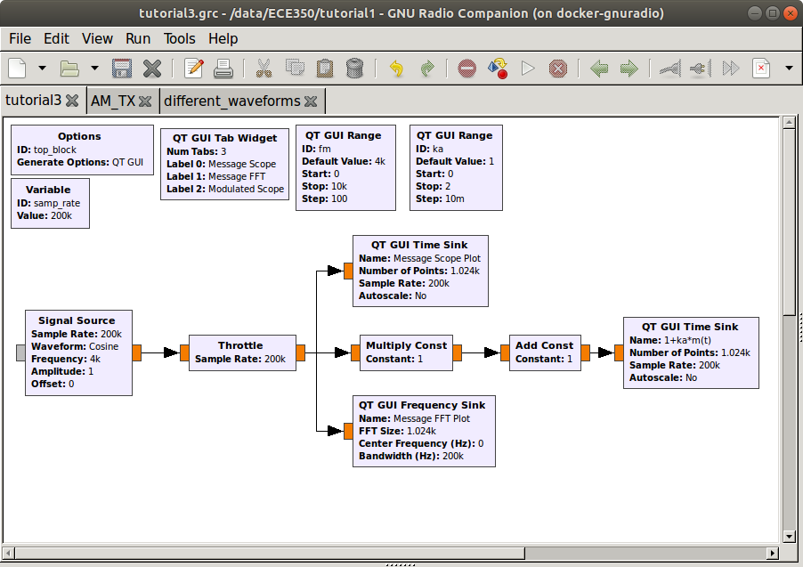 
    __*AM modulation flow graph*__

  - This flowgraph will be one of your deliverables. Save it as `AM_modulator.grc` and in the *Options* block, set the following parameters as follows.

    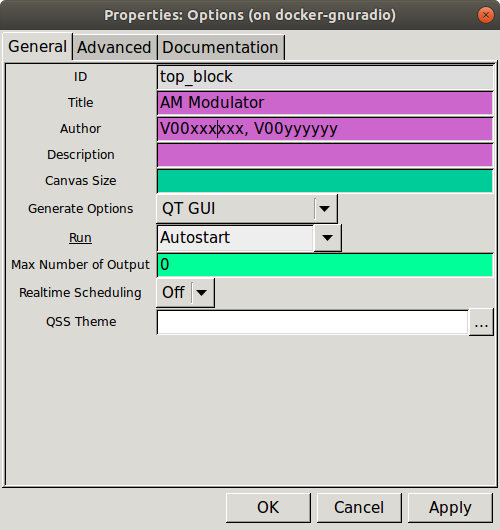 
    __*Flowgraph options parameters for submission*__

- You can read the *QT GUI Range* widget parameters right off of the flowgraph, and note that the sample rate is 200 kHz. You cannot however, tell when variables are in use without opening the blocks.

  - The two blocks using the *QT GUI Range* variables are the *Signal Source* and the *Multiply Const*. Use the following two figures as references.
  - Set the *Add Const* constant to 1.
  - You can name and organize the GUI sinks/scopes as you please. Don't forget to set *Config->Control Panel* to True in the GUI sinks to allow interactivity.

    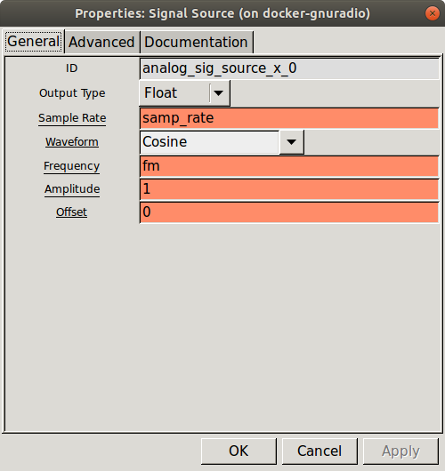 
    __*Signal source properties*__

    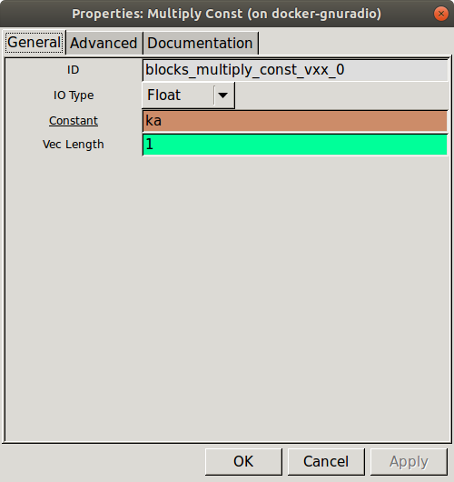 
    __*Multiple const properties properties*__

  >Note that this flowgraph is the graphical form of the modulation waveform, __1+k_a * m(t)__, where __m(t)__ is the *Signal Source* block, 1 is the *Add Const* block, and __k_a__ is the *Multiply Const* block.

- When executed, the three plots should look like the following:

    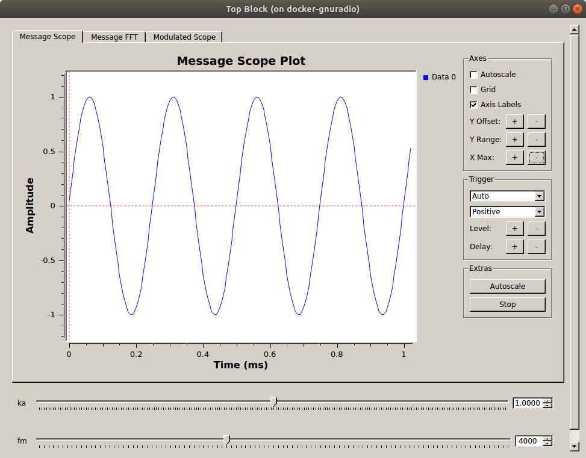 
    __*Message in time domain*__

    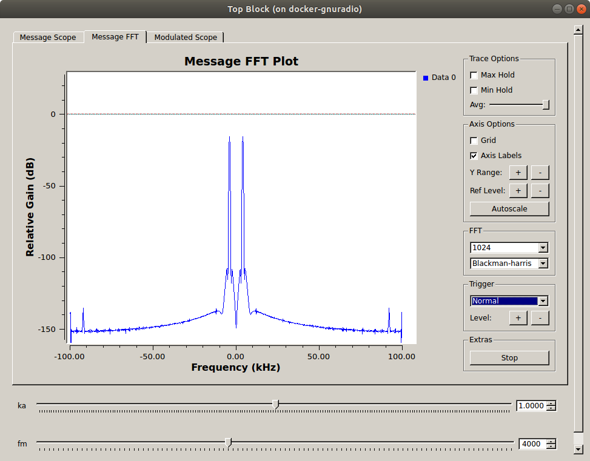 
    __*Message in frequency domain*__

    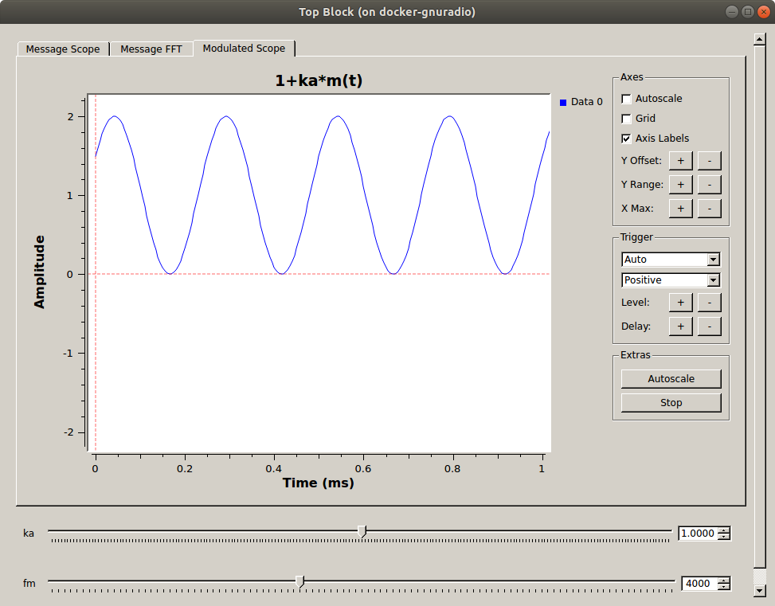 
    __*Modulation signal in time domain*__

---

#### Deliverable Question 1

Why is the spectrum symmetrical about 0 Hz?

---

- Now multiply the modulation waveform with the carrier signal to obtain the AM modulated waveform. Note the added *QT GUI Range* widget for _fc_.

  - Set the carrier signal source block frequency to _fc_.
  - In the *QT GUI Range* widget for the _fc_ variable, set the maximum value as *samp_rate/2*
  - In the *QT GUI Time Sink*:
    - change the number of inputs to two as shown, and connect one to each of the modulation waveform and the modulated carrier.
    - go to the *Config* tab and label the two lines as "Modulation waveform" and "Modulated signal" as appropriate.

    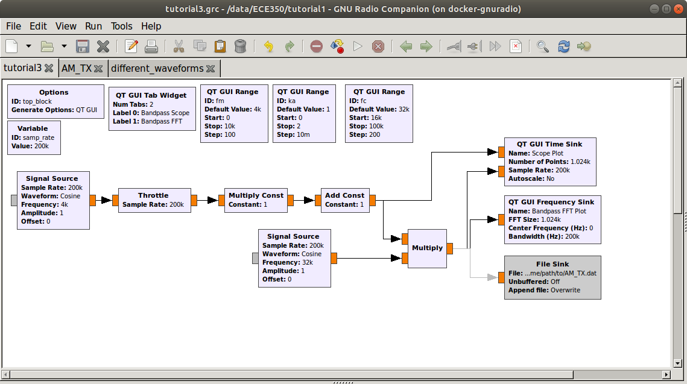 
    __*Flowgraph of AM modulation with a carrier*__

  >In GNU Radio Companion, greyed out boxes are "disabled". You can do this by right clicking on a block and selecting "Disable", or just pressing the "d" key on your keyboard. They greyed out File Sink will be used later.

- Explore the executed flowgraph. How does changing _fc_, _ka_, and _fm_ change the band pass time signal? How do they change the bandpass spectrum? The following figures show the default values.

  >When there are two inputs to a GUI Sink, they are plotted as different colors. You can click on their legend entries to hide and show each one.

     
    __*Modulated carrier and modulation waveform*__

    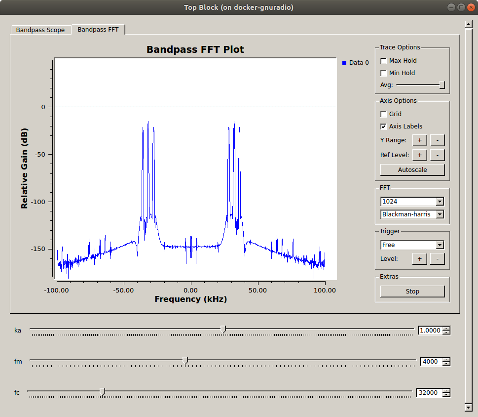 
    __*Modulated carrier spectrum*__

## Building an AM transmitter for general messages

Until now, we have only used a sinusoidal message. In this section, we will create four other waveforms and modulate them using amplitude modulation.

### Square wave with selectable frequency

- Create the following flowgraph to make a symmetric square waveform
  - Set the sample rate to 200 kHz.
  - Set a *Variable* block to have an ID of _fm_ and a value of 4000.
  - Set the *Signal Source* block to:
    - Waveform: Square
    - Frequency: fm
    - Amplitude: 2
    - Offset: -1

    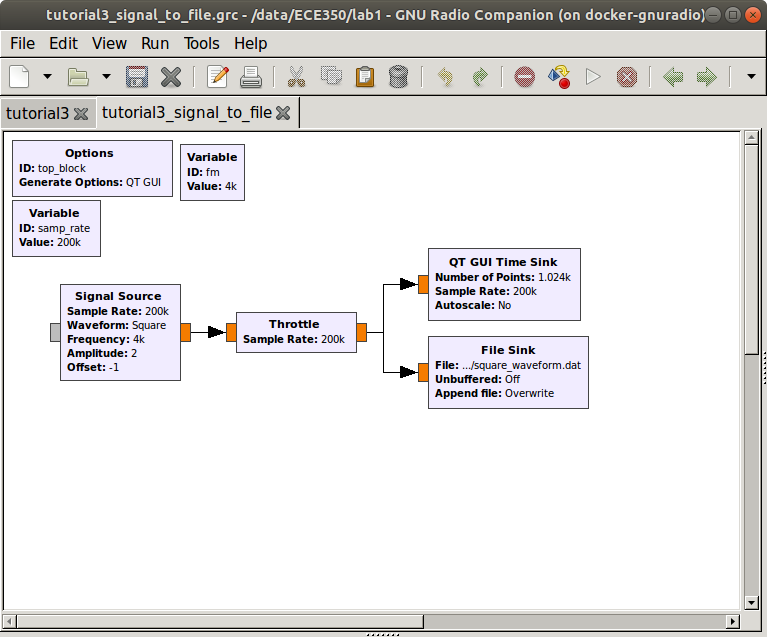 
    __*Square waveform generator*__

  - This flowgraph will be your second deliverable. Save it as `waveform_builder.grc`, and in the *Options* block, set the following:

    - **Title:** Waveform builder
    - **Author:** V00xxxxxx, V00yyyyyy (where all of your student numbers are included)

- You can save the generated waveform using a *File Sink* block. Choose a destination to save the file at, and name the file `square_waveform.dat`.

    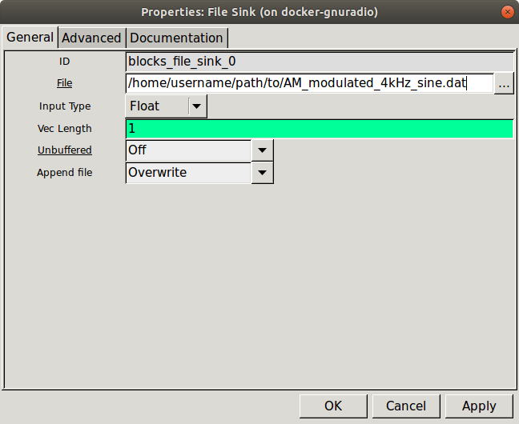 
    __*File Sink properties*__

- Execute the flowgraph and after a few seconds kill it. Check that the `.dat` file now exists.

  >A way to regulate the duration a flowgraph runs for is to use the [*Head* block](https://wiki.gnuradio.org/index.php/Head) to limit the number of samples that flow either from the input or into the *File Sink*.  
  
- Go back to your AM Modulator flowgraph and change the *Signal Source* block with a *File Source* block. Select `square_waveform.dat` as the source file and execute the flowgraph.

    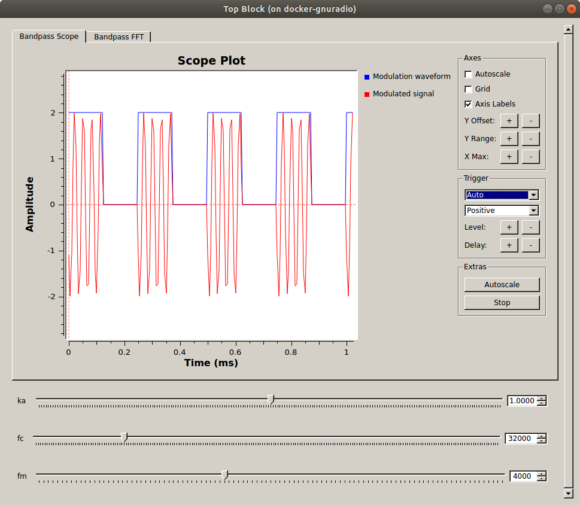 
    __*Modulated carrier and square modulation waveform*__

    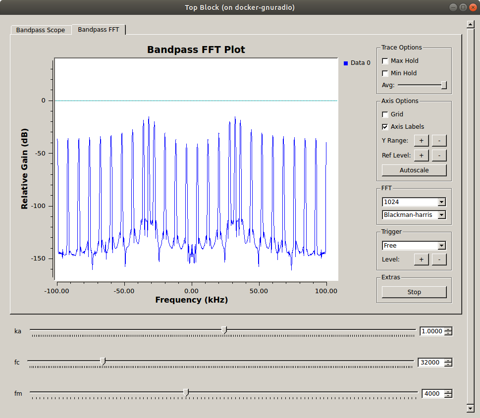 
    __*Modulated carrier spectrum for a square AM signal*__

### Two sine waves with selectable frequencies

- Update the `waveform-builder.grc` flowgraph as below, where two sinusoidal signals with frequencies _f1_ and _f2_ are mixed together to create a two-tone signal with *(f1-f2)* and *(f1+f2)* tones.

  - Update the *Signal Source* blocks to use the new variables, _f1_ and _f2_.
  - Save the output file as `two_sines_waveform.dat`

    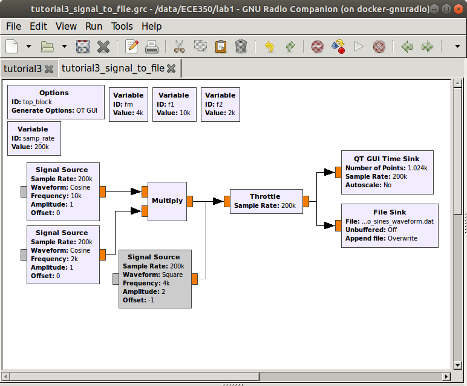 
    __*Two sines multiplied and saved to a `.dat` file*__

- Use the new `two_sines_waveform.dat` in your AM modulator.

    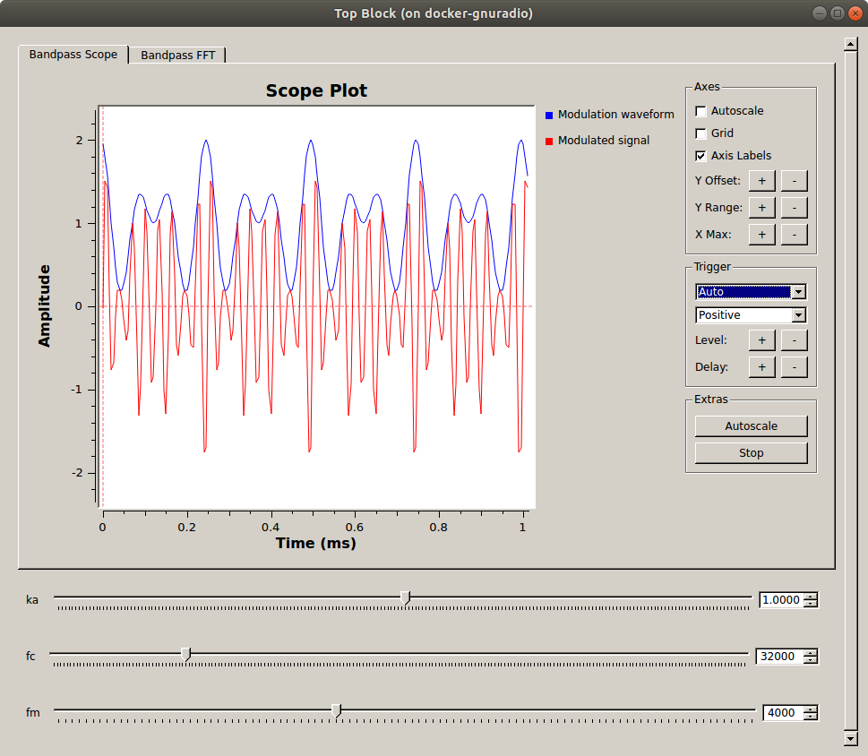 
    __*Modulated carrier and two sines modulation waveform*__

    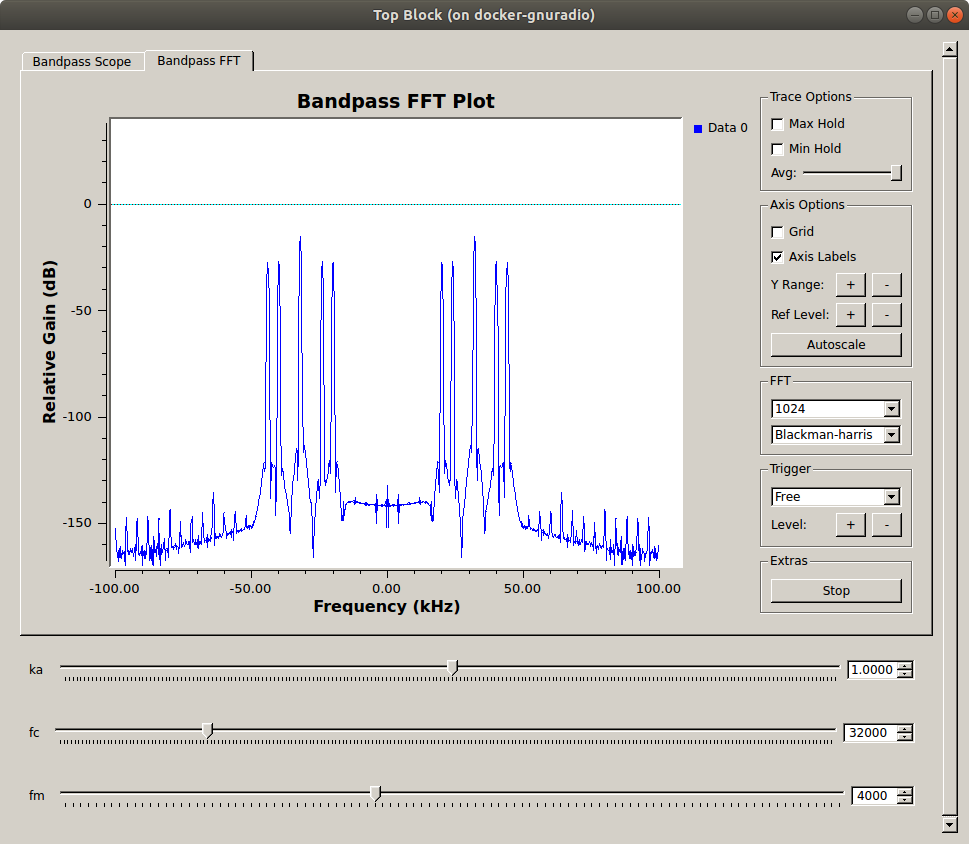 
    __*Modulated carrier spectrum for a two sines AM signal*__

### Pseudo Random Binary Sequence (PRBS) with time domain raised cosine pulse shape over 6 symbols

- Once again edit the `waveform-builder.grc` flowgraph to the following. In it, a message signal is created from a sequence of random binary bits which is converted to a sequence of pulses shaped using a raised cosine pulse shaping filter.

    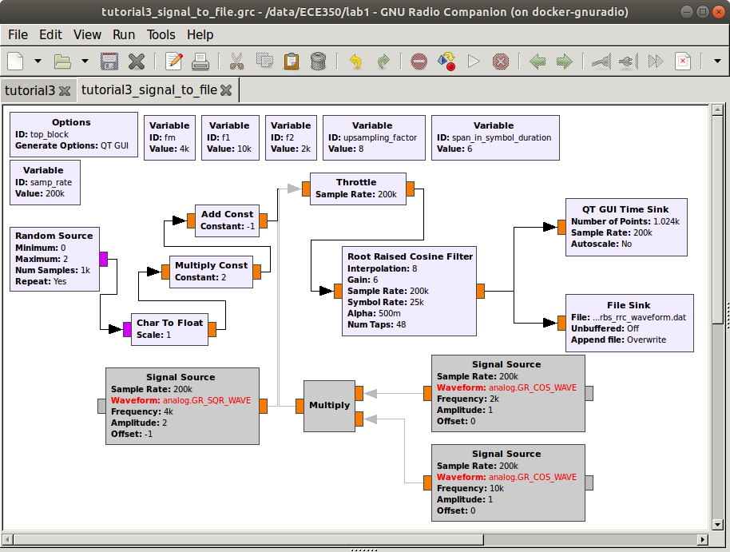 
    __*PRBS with a root raised cosine shape saved to a `.dat` file*__

  - The *Random Source* block generates a sequence of 1000 random bits which is repeated by keeping the _Repeat_ option as "Yes". The output type is "Byte" which is then converted to "Float" using a *Char to Float* block. The sequence of {0,1} bits are converted to {-1,1}, which is symmetric about zero by setting the parameters of the *Multiply Const* and *Add Const* blocks to 2 and -1 respectively.
  - The sequence of {-1,1} is converted to a sequence of pulses using the *Root Raised Cosine Filter* block. The main parameter of a raised cosine filter is it's roll-off factor (alpha), which indirectly specifies the bandwidth of the filter. Ideal raised cosine filters have an infinite number of taps. Practical raised cosine filters are windowed. The window length is controlled here using the _span_in_symbol_duration_ variable. Here, we specify the window length as 6 symbol durations (i.e. the filter spans six symbol durations). Raised cosine filters are used for pulse shaping, where the signal is upsampled. To do this, specify the upsampling factor to match the _upsampling_factor_ variable.
  
      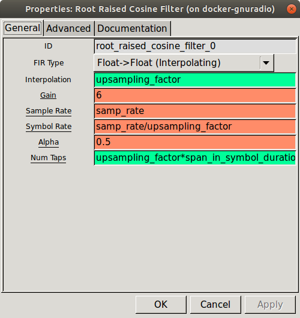 
    __*Root Raised Cosine Filter properties*__

- Save the output as `prbs_rrc_waveform.dat` and run it through the AM modulator.

    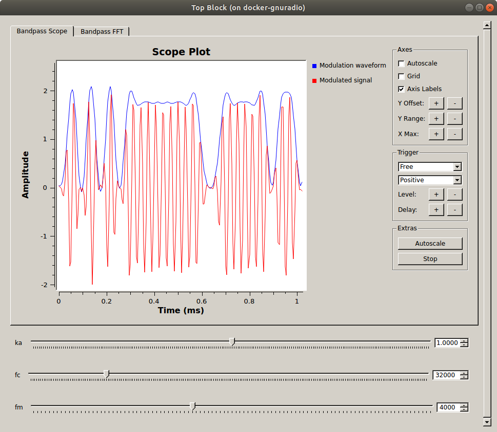 
    __*Modulated carrier and PRBC with RRC modulation waveform*__

    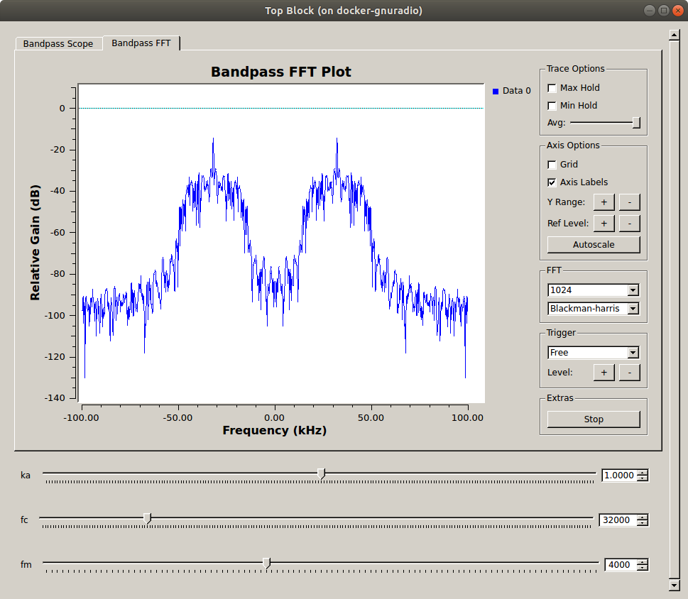 
    __*Modulated carrier spectrum for a PRBS with RRC AM signal*__

### PRBS with square pulse shape over 6 symbols

- Edit the `waveform-builder.grc` flowgraph and change the *Root Raised Cosine Filter* block to a *Interpolating FIR Filter* block, where all 8 of the taps are set to 1. This will make the pulse shape a square.

  > When a block is yellow in GRC it is in "bypass mode" where the samples pass through the block untouched. This can be done by right-clicking on the block and selecting "bypass" or by pressing "b" on your keyboard.

    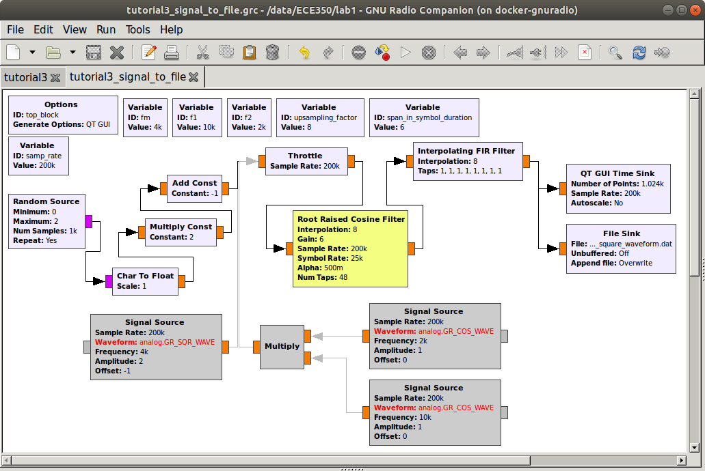 
    __*PRBS with a square shape saved to a `.dat` file*__

- Save the waveform to `prbs_square_waveform.dat` and run it through the AM modulator.

    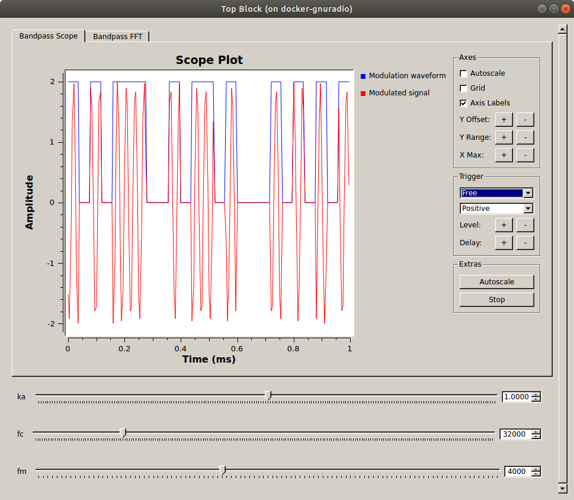 
    __*Modulated carrier and PRBC with square shape modulation waveform*__

    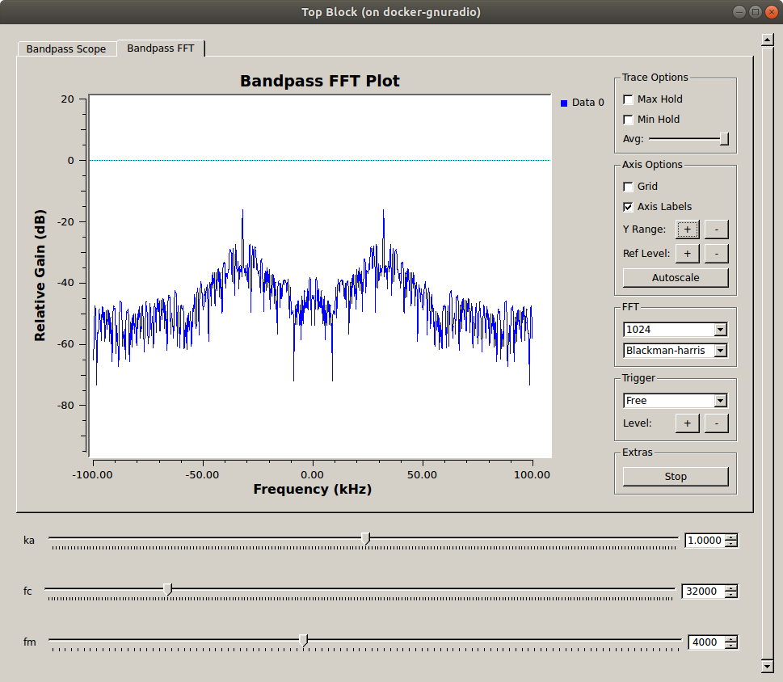 
    __*Modulated carrier spectrum for a PRBS with square shape AM signal*__

---
#### Deliverable Question 2

Why are the peaks of the modulated signal (shown above in red) not all the same value (a theoretical value of 2)?

---

## Deliverables

From this tutorial, keep the following files to submit to your TA after the next (and final) tutorial:

- `waveform-builder.grc`
- `AM_modulator.grc`.
- The answers to [Question 1](#deliverable-question-1) and [Question 2](#deliverable-question-2.)

**Do not attach the `top_block.py` or `.dat` files.**

---

[**Begin Tutorial 4**](tutorial4.md)
