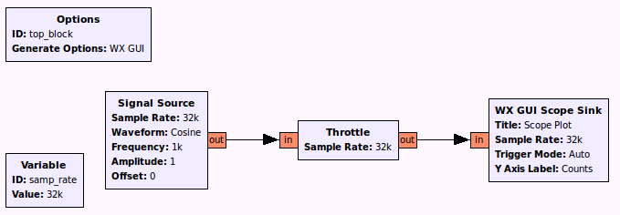
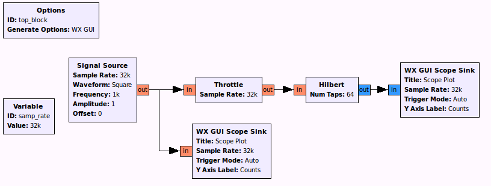
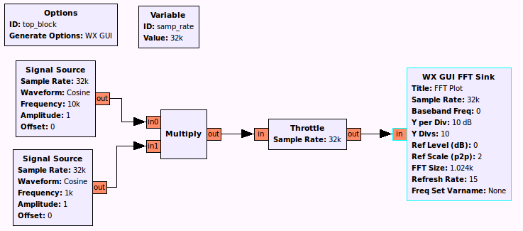
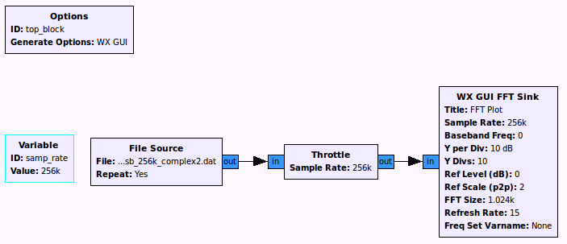
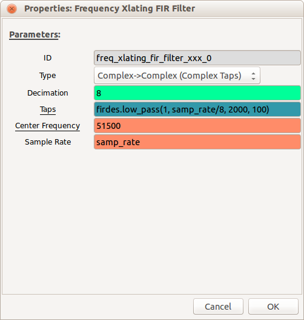
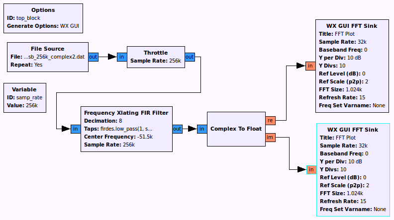
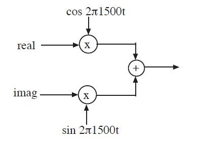
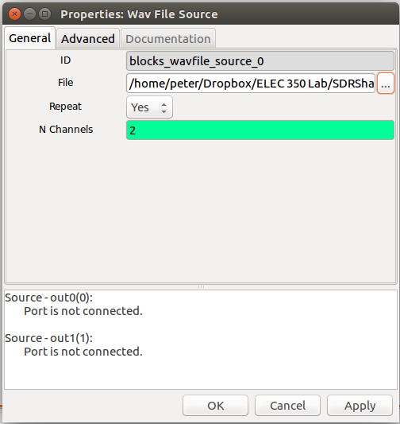

# Tutorial 4: Complex Signals and Receiving SSB

>## Objectives
>
>This tutorial is a guide to receiving SSB signals. It will also illustrate some of the properties of complex (analytic) signals and show why we use them in communications systems. In this tutorial you will:
>
>- Use the discrete Hilbert transform to create a complex signal from a real signal.
>
>- Use a frequency-translating filter to perform filtering and tuning in one step.
>
>- Construct an SSB demodulator using Weaver's Method.

## Complex/Analytic Signals

- Review the [sections 2.3 and 3.4 theory of analytic signals and SSB receivers](data/35015-PSK-FSK-12.pdf).

### Hilbert Transforms

- Open a new flow graph in GRC. Create the simple flow graph shown. Set the Type in each of the three blocks to Float as you have in the past. Other than that you can leave all of the values at their default settings.

   
  __*Figure 1.30: Flow graph with simple input and throttled output.*__

- Execute the flow graph. The scope sink should open and display a sinusoidal signal. Convince yourself that this signal has the amplitude and frequency that you expect.

- Modify the flow graph by changing the Type in each of the three blocks to *Complex*. Execute the flow graph. Your scope plot should now display two sinusoids that are 90° out of phase with each other. The leading (channel 1) wave is the I or in-phase component of the complex signal and the lagging (channel 2) wave is the Q or quadrature component. When a signal source is set to *Complex*, it will output both the I and Q components.

- Modify your flow graph as shown below. The *Signal Source* should be set to output a Square wave with a Type of Float. Thus, the first *Scope Sink* and the *Throttle* must also be set to accept Float values.

   
  __*Figure 1.31: Flow graph with square waveform input and Hilbert filter.*__

- The [Hilbert](http://www.ece.uvic.ca/~ece350/grc_doc/ar01s12s06.html) block is found in the *Filters* category. This block outputs both the real input signal and the Hilbert transform of the input signal as a complex signal. Leave the number of taps at its default setting of 64. Since the output of this block is complex, the second *Scope Sink* must be set to accept complex inputs.

- Execute the flow graph. Two scope plots should open. One should contain the square wave output from the *Signal Source* only. The other should include both the original square wave and its Hilbert Transform. Do you understand why the Hilbert transform of a square wave looks this way?

- As shown in the above figure, the *Signal Source* can be set to output a complex signal and display both the I and Q components. Modify the flow graph as shown below.

   
  __*Figure 1.32: Flow graph with a complex square wave input.*__

- Set the *Signal Source* to output a complex waveform. Make sure the *Throttle* and *Scope Sink* are also set to complex.

- Execute the flow graph. Is the complex waveform displayed here the same as the one obtained from the Hilbert transform? Your answer should be NO. This is incorrect. GRC is NOT displaying the correct Q component of a complex square wave. The Hilbert transform did output the proper waveform.

### Complex Multiplication

- Create the flow graph shown below. Make sure that all of the blocks are set to Type: Float. This flow graph takes two sinusoids, at frequencies of 1 kHz and 10 kHz and multiplies them together. Using a trigonometric identity we know that the product of two cosines gives two cosines at the sum and difference frequencies of the original signals. In this case we expect outputs at 9 kHz (difference) and 11 kHz (sum).

   
  __*Figure 1.33: Flow graph with two multiplied sinusoidal inputs.*__

- Execute the flow graph and confirm this result. Note that the FFT plot only shows the positive frequency spectrum when it is set to Type: Float. We know that for real inputs the negative frequency components are the same as positive frequency components.

- Change ALL of the blocks to Type: Complex and execute the flow graph again. You should now observe a single output at 11 kHz. This is the original 10 kHz signal shifted by the 1 kHz signal. If we want to shift in the negative direction a frequency of -1000 can be used. Try this. From this example we see two of the primary advantages of using analytic signals. A signal can be shifted (sum) without creating an additional difference signal. Also, note that there are NO negative frequency components. Why is this?

## Single Sideband (SSB) Signals

In this section you will learn one technique for demodulating Single
Sideband Signals. [This data file](data/ssb_lsb_256k_complex2.dat) will be used for the first
part of this tutorial.

This data file was recorded by a USRP set to a center frequency of
50.3 MHz with a sample rate of 256 kHz.

- Create a new flow graph as shown below. The *File Source* should be set to the data file that you just downloaded. The *Variable* block which sets the sampling rate (samp_rate) should be set to 256000 as this is the data rate that the received signal was sampled at. The *Throttle* and *FFT Sink* can be left at their default settings.

   
  __*Figure 1.34: Flow graph with a file source input.*__

- Execute the flow graph. After the FFT Plot window opens, adjust the *Ref Level* so that the amplitude values start at 10 dB and set the *dB/div* to 10 dB/div. You should view a section of the spectrum that is 256 kHz wide (due to the sample rate). Note that there is one signal visible between 40 and 60 kHz.

- When this signal was recorded, the USRP was set to a frequency of 50.3 MHz. Thus, the 0 kHz point on the display corresponds to 50.3 MHz. While the FFT Plot is displayed move the cursor over the signal and note the frequency along its right edge. It should be approximately 53 kHz. Since this is a lower sideband (LSB) signal, this corresponds to the carrier frequency. Because the "zero" frequency corresponds to 50.3 MHz, the original carrier frequency of signal was 50.3 MHz + 53 kHz = 50.353 MHz. However, now that the spectrum has been shifted down by 50.3 MHz, we use the carrier frequency of 53 kHz.

## Frequency Translating Filter

The first step in building a receiver is to use a channel filter to pass
the signal of interest and filter out the rest of the signals in the
band. This is done as follows

1. First the signal of interest is shifted down to zero frequency as shown below.

     
    __*Figure 1.35: Signal shifting.*__

2. Next a low pass filter is applied so that the other signals will be filtered out as shown below.

     
    __*Figure 1.36: Signal shifting with a filter.*__

In GRC, the *Frequency Xlating FIR Filter* performs both of these
operations.

- Insert [Frequency Xlating FIR Filter](http://www.ece.uvic.ca/~ece350/grc_doc/ar01s12s08.html) block between the *File Source* and the *Throttle*.

- Complete the properties window as shown in [figure_title](#tutorial4_freq_xlating_properties). The center frequency of 51500 will shift the entire spectrum down by 51500 Hz.
  > Note: The function indicated in the *Taps* parameter generates the taps for a low pass filter with a gain of 1 (in the pass band), a sampling rate equal to samp_rate (256 kHz), a cutoff frequency of 2 kHz and a transition width of 100 Hz.

   
  __*Figure 1.37: Frequency Xlating FIR Filter properties dialog.*__

- Execute the flow graph. You will see that your signal has now moved down to the origin and is the only signal present.

- Now that we have located the signal of interest, there is no reason that we need to be concerned with so much of the adjacent spectrum. We can reduce the range of frequencies that are being processed by reducing the sample rate (decimation). Re-open the *Frequency Xlating FIR Filter* block and change the *Decimation* parameter to 8. This will reduce the sample rate to 256000/8 = 32000. Change the sample rate of the *Throttle* and *FFT Sink* to this new rate. What frequency range to you expect the FFT to display now?

- Execute the flow graph again to see if you are correct. You should now observe an expanded version of your signal. Select *Autoscale* on the FFT Plot so that the peaks of the signal are observed. Notice that after a while, the signal level will be reduced for a few seconds. That occurs when the station stops transmitting.

## Using the firdes Module

In the previous step, we used the firdes module of GNU Radio. For more
information on this tool, [check out the documentation](http://gnuradio.org/doc/doxygen/classgr_1_1filter_1_1firdes.html#details).

This module is used for generating finite impulse response (FIR) filters
in GNU Radio. There are a number of filters available that can be
explored in the API Reference link above. Some of the commonly used
filters are listed below. The basic usage format is
**firdes.filter_type(args)** where **filter_type(args)** is one of:

- band_pass(gain, sampling_freq, low_cutoff_freq, high_cutoff_freq, transition_width)

- band_reject(gain, sampling_freq, low_cutoff_freq, high_cutoff_freq, transition_width)

- complex_band_pass(gain, sampling_freq, low_cutoff_freq, high_cutoff_freq, transition_width)

- high_pass(gain, sampling_freq, cutoff_freq, transition_width)

- low_pass(gain, sampling_freq, cutoff_freq, transition_width)

This list indicates the minimum number of arguments required for the
filter to be generated. Each filter can also take an argument for
the **type of window** it uses and the **beta value**. Additionally, each
of these filter types has a "_2" version (ie: band_pass_2,
low_pass_2). These versions take an extra parameter which specifies
the stop band attenuation in dB. It is worthwhile to familiarize
yourself with the usage of this module as it will be used throughout
these labs.

## Weaver Demodulator

Recall that the signal is a complex (analytic) signal. One method of
demodulating SSB voice is to operate on the real and imaginary parts of
the signal separately. The *Complex to Float* block will take a complex
signal and output its real (re) and imaginary (im) parts separately.

- Modify the flow graph to appear as shown below. The outputs of the [Complex to Float](http://www.ece.uvic.ca/~ece350/grc_doc/ar01s11s03.html) block are both real so the *FFT Sinks* need to be changed to Type: Float.

   
  __*Figure 1.38: Flow graph with a complex input and filtering scheme, but real outputs.*__

- Execute the flow graph. You should now observe the spectra of the real and imaginary parts of the signal. Note that the signals extend out to 2KHz, the cutoff frequency of the filter.

- One method of demodulating this SSB voice signal, known as Weaver's method, takes the real and imaginary part of the signal and processes them as shown below. Use the *Signal Source* in GRC to generate the cosine and sine waves needed to implement this demodulator. The *Multiply* and *Add* blocks can be found in the *Math Operators* category.

   
  __*Figure 1.39: Weaver demodulation.*__

- Observe the output of the *Add* block using an *FFT sink*. This is the baseband signal that has been extracted from the modulated SSB signal.

- The final step is to listen to the demodulated signal. Add an *Audio Sink* as demonstrated in Tutorial 3. Recall that you will need a *Rational Resampler* to adjust the sampling rate to one that works with the *Audio Sink*.

- You will also need a multiplier to reduce the amplitude of the signal before it enters the *Audio Sink*. Find a suitable value by first observing the maximum peak on a scope sink and using the reciprocal of this value as the multiplier.

- Test your SSB receiver; you should hear the voice.
  - Note: It may be helpful to add a *waterfall sink* to aid in locating the signal of interest.

- The Weaver demodulator can also be implemented entirely with complex signals. Create a second SSB receiver using only complex signals, with conversion to real just before the audio sink. Test this receiver and confirm that it works in the same way as the receiver using real signals.

- Test this receiver using [this data file](./data/SDRSharp_20130920_024052Z_14190kHz_IQ.wav). This is a WAV file! To read it in GNURadio:
  - Add a *Wav File Source* and modify its properties as shown below.
  - This WAV file was recorded using the I and Q streams for the L and R channels. By setting the block to have two output channels you will be able to use the full I/Q signal.
  - Add a [Float To Complex](http://www.ece.uvic.ca/~ece350/grc_doc/ar01s11s10.html) block to convert from I and Q to a complex signal.

   
  __*Figure 1.40: WAV File Source properties dialog.*__

- There are two SSB voice signals in this file, both are upper sideband (USB), whereas the first data file was lower sideband (LSB). The Weaver demodulator needs a small modification to work with USB.
  > Hint: Refer to the diagram above illustrating the Weaver Demodulator and now consider using the upper sideband.

- A data file taken using a software receiver with a wire antenna about 6 meters above the ground is found [here](./data/SDRSharp_20130919_004154Z_14053kHz_IQ.wav).
  - Change the Wav File Source to read this file, and test your receiver using this file.
  - The file contains mostly Morse code signals, no voice signals. Replace the fixed offset of 1500 Hz with a variable and control it with a WX GUI Slider. What happens when the slider is moved and why?
  - Replace the fixed bandwidth of the firdes module with a variable and control it with a Slider. For receiving Morse code signals, a bandwidth of 50-200 Hz is best.

Save this flowgraph. You can modify it for use with the RTL-SDR receiver
and listen to live Morse code and SSB signals in the frequency range
24.9-25.0 MHz, 27-29 MHz, 50.0-50.2 MHz. These frequencies will
propagate over long distances via the ionosphere for some (not all) of
the time. Other frequencies are 144.0-144.3 MHz and 145.8-146.0 MHz.

[**Continue to Lab 2**](../_lab2/lab2.md)
