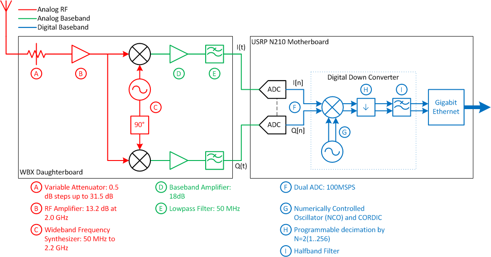

In this lab you will begin using complex signals and create an SSB demodulator. As you work through tutorial 1, keep the following questions in mind:

- How is an SSB signal demodulated into an audio signal?
- What methods are used to tune to a desired signal?

You will then use the Universal Software Radio Peripherial (USRP) for both receiving and transmitting signals. The USRP is a I/Q receiver with wide bandwidth (100 MHz sampling rate), programmable center frequency, programmable gain and choice of sample rates.

For detailed information on the usage of the USRP, you can find the data sheet and user manual as well as the range of compatible daughterboards at the [Ettus website for the USRP N210](https://www.ettus.com/product/details/UN210-KIT).

Refer to the below block diagram to understand the receive path of the USRP as it is set up in the lab. The USRPs in the lab have the WBX daughtercard installed which feature a programmable attenuator, programmable local oscillator and analog I/Q mixer. The WBX daughterboard is an analog front end for the GNU Radio software. It consists of a local oscillator implemented as a wideband frequency synthesizer, thus allowing the USRP to receive signals in the range from 50 MHz to 2.2 GHz. The WBX Daughterboard performs complex downconversion of a 100 MHz slice of spectrum in the 50-2200 MHz range down to -50 to +50 MHz range for processing by the USRP motherboard.

 
__*Figure 2.1: USRP block diagram.*__

The main function of the USRP motherboard board is to act as a [Digital Downconverter (DDC)](http://en.wikipedia.org/wiki/Digital_down_converter). The motherboard implements a digital I/Q mixer, sample rate converter and lowpass filter. The samples are then sent to the host PC over a gigabit ethernet link.

We will first learn about FM waveform generation and reception in software simulation-only without the URSP, then FM receiver implemented with the USRP, general IQ receiver implemented with the USRP, and finally the USRP transmit function.

---

## Deliverables

1. SSB flowgraphs
    - GRC file of SSB receiver using Weaver\'s method.
    - block diagram of SSB receiver showing mathematical representation of signals at all points
  
2. FM flowgraphs
    - GRC files of FM transmitter and receiver showing FM transmitted waveforms, spectra and FM receiver output.

3. USRP with FM
    - Observations on practical FM receiver operation using live off-air signals
    - bit rate of FSK signal at 142.17 MHz
    - Estimate of URSP receiver dynamic range with FM signals

4. USRP with general IQ signals
    - Estimate of the USRP receiver noise figure.
    - IQ receiver measured frequency offset
    - Observations of I and Q at different signal levels and effect of dynamic range
    - USRP spectrum, minimum and maximum output power

>As usual, there are a number of questions included within the text. Written answers to these questions are not required, but an effort should be made to think about and answer these questions as they are encountered.

---

[**Begin Tutorial 1**](tutorial1.md)
