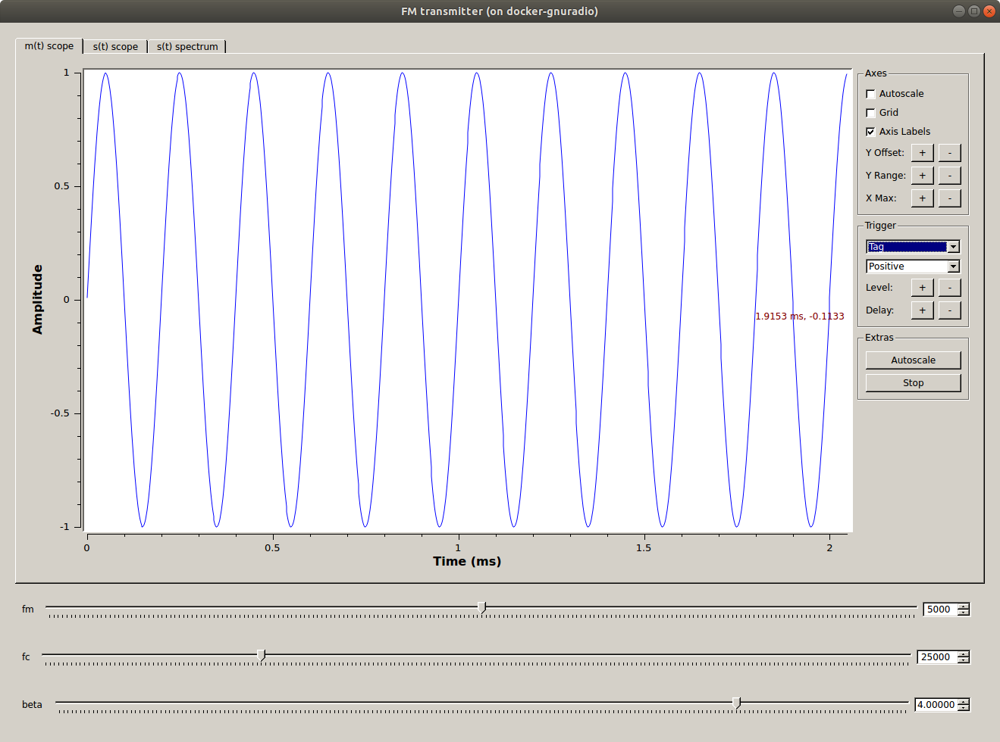
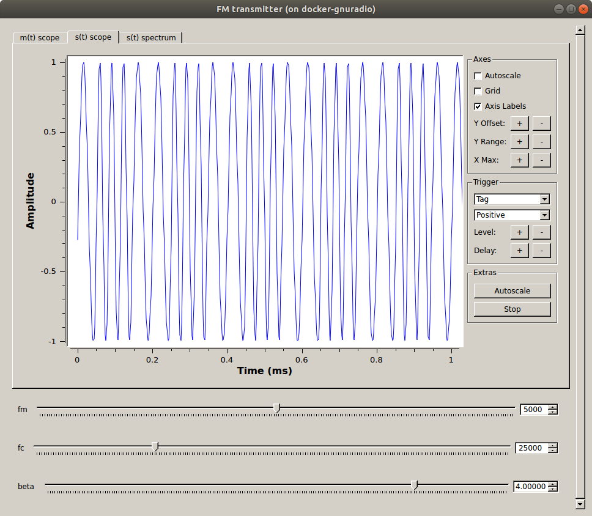
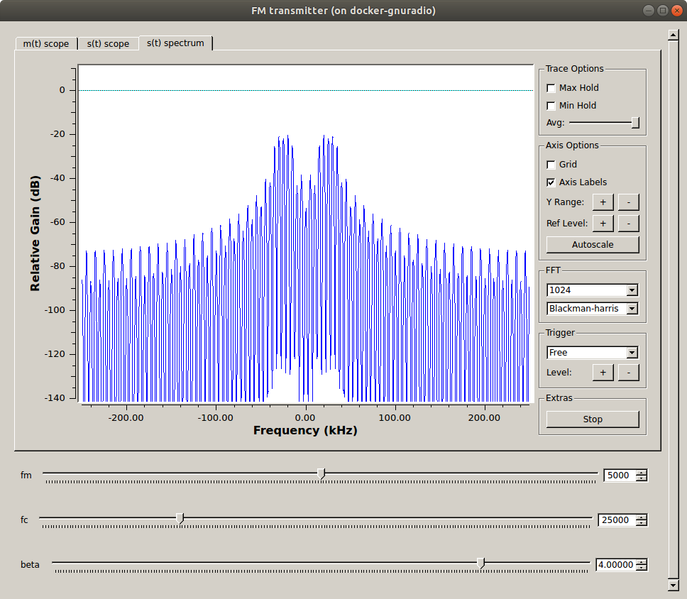

[**Back to Lab 3 Intro**](introduction.md) | [**Begin Part 2**](FM-receiver-simulation.md)

## Objectives

This part of the lab is a guide to transmitting FM signal waveforms. You
will:

- learn the theory and equations of FM signals, power spectra, bandwidths, and FM modulation

- construct an FM transmitter flowgraph to generate an FM waveform with both a sinusoidal message and a square wave message

---

## Part 1 Deliverables
<!-- #TODO review -->

- One GRC file of an FM transmitter. You will be stepped through building it.
- There is 1 question in this part. It is clearly indicated.
  - The question requires approximately 1 line of writing, and addresses a concept, not details. Answer the question and submit a single page containing the answers to your TA at the end of the lab.

---

You are going to build flowgraphs to transmit FM signals that are simulation-only and do not (yet) use the USRP (that will come later in this lab!).

## Theory

- Review the theory of [FM Signals](../_docs/pdriessen_textbook.pdf) (section 5).
- Recall that for a sinusoidal modulating wave,

    $$m(t) = A_{m}cos\left( 2\pi f_m t\right) $$

  the FM wave can be written as any of:
  
    $$
    \begin{align*}
        s(t) &= A_{c}cos\left( 2\pi f_c t + \beta sin \left(2\pi f_m t \right) \right) \\

        &= I(t)cos \left( 2\pi f_c t \right) - Q(t)sin \left( 2\pi f_c t \right) \\

        &= a(t)cos \left( 2\pi f_c t + \phi (t) \right)
    \end{align*}
    $$

  where:

    $$ a(t) = A_c $$

    $$ \phi (t) = \beta sin \left( 2\pi f_m t \right) $$

    $$ I(t) = A_c cos \left( 2\pi f_m t \right) $$

    $$ Q(t) = A_c sin \left( 2\pi f_m t \right) $$

<!-- #TODO what is beta -->

## Building an FM transmitter for a sine message

You'll start by transmitting a sinusoidal message. The equations for this are shown in the [theory section](#theory) above.

- Start GRC and change the default sampling rate to be 200 kHz.

- This flowgraph will be your first deliverable. Save it as `FM_transmitter.grc`, and in the *Options* block, set the following:

  - **Title:** FM transmitter
  - **Author:** V00xxxxxx, V00yyyyyy (where all of your student numbers are included)

- From the equations above, create some variables controlled with sliders.
  - Add a *QT GUI Range* for each of $$ f_m $$, $$ f_c $$ and $$ \beta $$.
  - For the message frequency, range from 0-10 kHz with a default value of 2 kHz.
  - For the carrier frequency, range from 0-100 kHz with a default value of 25 kHz.
  - For the beta value, fange from 0-4 with a default value of 4, and a step size of 0.025.

- Construct a flowgraph representation of $$ \phi (t) $$ using a *Signal Source* block and a *Multiply Const* block.
  - Change the *Output Type* to *Float*.
  - Use the variables from the *QT GUI Range* widgets for $$ \beta $$ and $$ f_m $$.
  - The flowgraph should now look like the following figure.

     
    __*Graphical representation of $$ \phi (t) $$*__

  - **Can you read this flowgraph as equivalent to the equation for $$ \phi (t) $$ ?**

- Add a *Throttle* block after the $$ \beta $$ multiplication.
- In order to take the sine and cosine of $$ \phi (t) $$, split the output of the *Throttle* block into two *Transcendental* blocks.
  - One of the *Transcendental* blocks should have `cos` set as the function, and the other should have *sin* set as the function.
  - These two streams represent $$ I(t) $$ and $$ Q(t) $$ from the equations in the [theory section](#theory) above. Notice that $$ A_c $$ is not used and so is equal to 1.

- Following the equations in the [theory section](#theory), $$ I(t) $$ and $$ Q(t) $$ are multiplied by $$ cos(2\pi f_c t) $$ and $$ -sin(2\pi f_c t) $$ of the carrier frequency respectively.
  - Add two *Signal Source* blocks and two *Multiply* blocks.
  - Ensure that $$ cos(2\pi f_c t) $$ is multiplied with $$ I(t) $$ while $$ -sin(2\pi f_c t) $$ is multiplied with $$ Q(t) $$.
    - To get the negative value in front of the sine, choose an amplitude of -1 in the appropriate *Signal Source* block.

- Use an *Add* block to combine the two streams and obtain $$ s(t)$$.

- Visualize the output of the flowgraph using a:
  - *QT GUI Time Sink* at $$ m(t) $$
  - *QT GUI Time Sink* at $$ s(t) $$
  - *QT GUI Frequency Sink* at $$ s(t) $$
  > As always, you are free to use the *QT GUI Tab Widget* to organize the GUI however you like. If you need a refresher on how to use this tool, it is covererd in the [intro tutorials](../_intro/introduction.md).

- The flowgraph should now look like the following figure

   
  __*Flowgraph of a FM transmitted sine message*__

- Leaving default values unchanged, the output should look like the following figures.
  
   
  __*$$ m(t) $$ with default values in time domain*__

   
  __*$$ s(t) $$ with default values in time domain*__

   
  __*$$ s(t) $$ with default values in frequency domain*__

  - Experiment with adjusting the three sliders.

---
#### Deliverable Question 1

What does $$ \beta $$ control?

---

- Add a *File Sink* block as well to capture $$ s(t) $$ but leave it disabled for now.

- Your flowgraph should look similar to the following.

   
  __*Graphical representation of $$ s(t) $$*__

- Enable the *File Sink* block and save a file called `FM_TX_2kHz_sine.dat`. You will need to execute the flowgraph for a few seconds to build the file.

## Building an FM transmitter for an FSK message

Up until now the transmitted message has been a sine wave of frequency $$ f_m $$. You will now simulate transmitting a Frequency Shift Keying (FSK) signal by transmitting a square waveform (which is an FSK pattern of `101010...`).

The integral of a square waveform is a triangular waveform with the same frequency as the square waveform. So for frequency modulation, it is enough to replace the sunisoidal source in the flowgraph with a triangular source.

- Change the *Signal Source* block to output a triangular waveform of frequency $$ f_m $$.

- With the *File Sink* block disabled, execute the flowgraph and observe the various plots. Adjust the sliders to see how it impacts the transmitted signal.

- The following figures show $$ m(t)$$  and $$ s(t) $$ with default parameters.

   
  __*$$ m(t) $$ with default values in time domain*__

   
  __*$$ s(t) $$ with default values in time domain*__

   
  __*$$ s(t) $$ with default values in frequency domain*__

- Enable the *File Sink* block and save a file called `FM_TX_2kHz_square.dat`. You will need to execute the flowgraph for a few seconds to build the file.

- Save this GRC file now, it is a deliverable.

---

At this point, you should have:

- one GRC file
  - `FM_transmitter.grc`
- 2 data files
  - `FM_TX_2kHz_sine.dat`
  - `FM_TX_2kHz_square.dat`

## Deliverables

From this lab part, keep the following for later submission to your TA:

- `FM_transmitter.grc`
- The answer to [Question 1](#deliverable-question-1)

**Do not attach the `top_block.py` or `.dat` files. You will use some of the `.dat` files in the next part though, so don't delete them yet!**

---

[**Back to Lab 3 Intro**](introduction.md) | [**Begin Part 2**](FM-receiver-simulation.md)